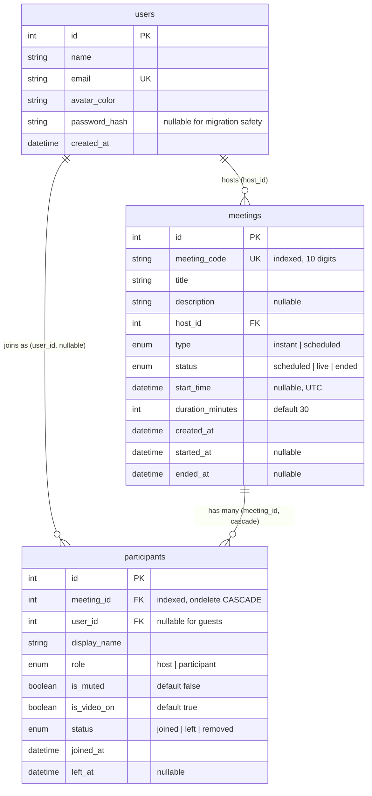
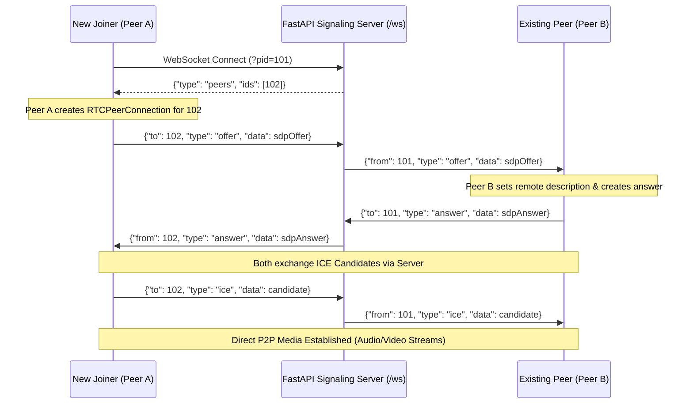

# 🎯 Zoom Clone — Complete Interview Preparation & Technical Architecture Guide

> **Target Role:** Full Stack Engineer (Python/FastAPI + Next.js/React + WebRTC + SQLite/PostgreSQL)  
> This guide thoroughly details every design decision, code path, data flow, schema definition, and interview talking point for this Zoom Clone project. Keep this guide open as you prepare for your technical interviews.

---

## Table of Contents

1. [Assignment Brief & Evaluation Criteria Mapping](#1-assignment-brief--evaluation-criteria-mapping)
2. [Tech Stack at a Glance & Architectural Trade-offs](#2-tech-stack-at-a-glance--architectural-trade-offs)
3. [Project Directory & File-by-File Responsibility](#3-project-directory--file-by-file-responsibility)
4. [Database Design & Schema Deep Dive](#4-database-design--schema-deep-dive)
5. [Authentication & Guest Flow (Detailed Walkthrough)](#5-authentication--guest-flow-detailed-walkthrough)
6. [Backend API Deep Dive (FastAPI Endpoints)](#6-backend-api-deep-dive-fastapi-endpoints)
7. [Frontend Architecture & Next.js App Router](#7-frontend-architecture--nextjs-app-router)
8. [Real-time WebRTC Mesh Video & WebSocket Signaling](#8-real-time-webrtc-mesh-video--websocket-signaling)
9. [Critical Bug Fixes & Edge Case Solutions](#9-critical-bug-fixes--edge-case-solutions)
10. [Essential SQL Queries to Know by Heart](#10-essential-sql-queries-to-know-by-heart)
11. [TR-1 Technical Interview Q&A Bank](#11-tr-1-technical-interview-qa-bank)
12. [Live Coding Challenges & Step-by-Step Plans](#12-live-coding-challenges--step-by-step-plans)

---

## 1. Assignment Brief & Evaluation Criteria Mapping

### 1.1 What the Assignment Asked For vs. How It Is Implemented

| Requirement | Brief Requirement | Our Implementation | Code Location |
|---|---|---|---|
| **Goal** | Working Zoom web app clone with accurate look and feel. | Exact Zoom color palette (`#0B5CFF`, `#232333`, `#F5F5FA`), typography, docked side-rail, responsive meeting room. | `frontend/app/globals.css`, `frontend/components/` |
| **Frontend** | Next.js, built as Single Page Application (SPA). | Next.js 16 App Router with client-side navigation (`useRouter`, `Link`). No hard page reloads. | `frontend/app/` |
| **Backend** | Python with FastAPI or Django. | FastAPI (async endpoints, Pydantic v2 schemas, WebSocket router, auto-docs). | `backend/app/main.py`, `backend/app/routers/` |
| **Database** | SQLite, custom schema design evaluated on normalization and keys. | SQLite 3 via SQLAlchemy 2.0 ORM (`users`, `meetings`, `participants`). Fully normalized. | `backend/app/database.py`, `backend/app/models.py` |
| **Default User & Auth** | Assume one default user is always logged in; allow guest joins. | Hybrid: Default user (`alex@example.com` / `demo1234`) with 1-click fill button, registration, in-memory tokens, AND direct guest join without logging in. | `backend/app/routers/auth.py`, `frontend/app/login/page.tsx`, `frontend/lib/user.ts` |
| **Sample Data** | Seed the database with sample meetings. | Auto-seeding on startup via `seed_if_empty()`: creates default user, 4 dynamic upcoming meetings, and 5 past ended meetings. | `backend/app/seed.py` |
| **README & Original Work** | Setup steps, tech stack, assumptions, no copy-pasting. | Detailed markdown documentation covering setup, architecture, WebRTC mesh, and deployment. | `README.md` |
| **Deployment** | Public GitHub repo + deployed app. | Frontend deployed on **Vercel** (`https://zoom-clonehv.vercel.app`), Backend deployed on **Render** (`https://zoom-clone-dq29.onrender.com`). | `render.yaml`, `frontend/next.config.ts` |

---

### 1.2 Evaluation Rubric & Panel Expectations

The interview panel evaluates candidates across 6 specific criteria:

1. **Functionality:**  
   Every core feature works on the live link. Edge cases are handled: invalid meeting code returns 404, empty name prompts validation toast, scheduled past dates are blocked, audio/video toggle states persist.
2. **UI / UX Fidelity:**  
   Matches Zoom's desktop & web client layout: 56px top bar with search placeholder and avatar, 72px side rail navigation, 4-button quick launch cluster, 16:9 pre-join camera preview, dark-mode meeting room (`#0F0F0F`) with auto-adjusting video grid and docked right drawer.
3. **Database Schema:**  
   Clear primary keys, foreign keys (`ondelete="CASCADE"`), unique constraints on `meeting_code` and `email`, UTC timestamp storage with timezone serialization, indexed lookups on `meeting_code` and `meeting_id`.
4. **Code Quality:**  
   Strict TypeScript interfaces, Pydantic input/output schemas with field serializers, centralized error handling with Sonner toasts, clean function abstractions.
5. **Code Modularity:**  
   Frontend split into reusable modular components (`video-tile.tsx`, `control-bar.tsx`, `participants-panel.tsx`, `clock.tsx`, `action-buttons.tsx`). Backend split into modular routers (`auth`, `meetings`, `participants`, `signal`).
6. **Code Understanding:**  
   Ability to explain any line of code, justify architectural trade-offs (e.g., WebRTC Mesh vs. SFU, in-memory tokens vs. JWT, SQLite vs. PostgreSQL), and modify features live.

---

## 2. Tech Stack at a Glance & Architectural Trade-offs

| Layer | Technology | Why Chosen Over Alternatives |
|---|---|---|
| **Frontend Framework** | Next.js 16 (App Router) + React 19 | Combines server-side rendering for meta tags with fast client-side SPA routing. Eliminates React Router configuration. |
| **Language** | TypeScript 5 (Strict Mode) | Catch type errors at build time; provides auto-completion for backend API response shapes across components. |
| **Styling** | Tailwind CSS v4 + Radix UI + Lucide Icons | Utility-first CSS allows exact color hex matching (`#0B5CFF` Zoom primary, `#232333` text, `#0F0F0F` room background). Radix provides accessible popovers and dialogs. |
| **Backend Framework** | FastAPI (Python 3.11+) | Async native performance with Starlette, automatic OpenAPI/Swagger documentation generation (`/docs`), and native WebSocket support for WebRTC signaling. Chosen over Django for lower overhead. |
| **ORM** | SQLAlchemy 2.0 (Declarative Base) | Clean model definitions, automated relationship wiring with cascade rules, and seamless migration between SQLite (development) and PostgreSQL (production). |
| **Database** | SQLite (Dev/Render Free) / PostgreSQL ready | SQLite requires zero configuration and zero external processes. Schema is designed with PostgreSQL-compatible data types (`DateTime`, `Enum`, `String(10)`). |
| **Real-Time Video** | Native WebRTC Peer-to-Peer Mesh (`RTCPeerConnection`) | Real hardware camera/microphone streaming between browser tabs with zero third-party paid subscriptions (Agora, Twilio, Daily.co). |
| **Signaling** | FastAPI WebSockets (`/ws/{code}`) | Lightweight bi-directional JSON transport for SDP offers, SDP answers, ICE candidates, and host action broadcasts. |

### Architectural Flow Diagram

```
┌────────────────────────────────────────────────────────┐
│                   Browser (Next.js SPA)                │
│  - App Shell: TopBar, SideRail, Clock, ActionButtons   │
│  - Pre-Join: getUserMedia preview, mic/cam prefs       │
│  - Meeting Room: RTCPeerConnection mesh + polling      │
└───────────────┬───────────────────────────▲────────────┘
                │ REST (HTTP/JSON)          │ WebSocket
                │ POST /api/meetings/join   │ /ws/{code}?pid={id}
                ▼                           │
┌───────────────────────────────────────────┴────────────┐
│                    FastAPI Backend                     │
│  - Routers: auth, meetings, participants, signal       │
│  - Lifespan: Base.metadata.create_all, auto-migration  │
│  - Signaling Hub: in-memory rooms dict                 │
└───────────────┬────────────────────────────────────────┘
                │ SQLAlchemy 2.0 ORM
                ▼
┌────────────────────────────────────────────────────────┐
│                   SQLite / PostgreSQL                  │
│  - users (id, name, email, password_hash)              │
│  - meetings (id, meeting_code, title, status)          │
│  - participants (id, meeting_id, user_id, role, state) │
└────────────────────────────────────────────────────────┘
```

---

## 3. Project Directory & File-by-File Responsibility

```
zoom-clone/
├── backend/
│   ├── app/
│   │   ├── __init__.py
│   │   ├── main.py              # Application entry, CORS, lifespan migration, /api/me
│   │   ├── database.py          # SQLAlchemy engine, SessionLocal, get_db dependency
│   │   ├── models.py            # ORM tables: User, Meeting, Participant + Enum classes
│   │   ├── schemas.py           # Pydantic v2 schemas with ISO 8601 UTC serializers
│   │   ├── utils.py             # generate_meeting_code() (10 digits), normalize_code()
│   │   ├── seed.py              # seed_if_empty() with default user & rolling upcoming meetings
│   │   └── routers/
│   │       ├── auth.py          # /api/auth: register, login, me (SHA-256 + token store)
│   │       ├── meetings.py      # /api/meetings: CRUD, upcoming, recent, join, end, mute-all
│   │       ├── participants.py  # /api/participants: list, patch self, leave (with host transfer), remove
│   │       └── signal.py        # /ws/{code}: WebRTC signaling hub + broadcast_to_room()
│   └── requirements.txt         # fastapi, uvicorn, sqlalchemy, pydantic, python-dotenv, psycopg2-binary
├── frontend/
│   ├── app/
│   │   ├── layout.tsx           # Root layout: font setup, metadata, global Providers
│   │   ├── providers.tsx        # Global Sonner Toaster (single instance, top-center)
│   │   ├── login/
│   │   │   └── page.tsx         # Sign In / Register + 1-Click Demo Fill + Guest Direct Join
│   │   ├── (app)/
│   │   │   ├── layout.tsx       # Auth Guard layout: verifies token, renders TopBar + SideRail
│   │   │   ├── page.tsx         # Dashboard: Clock, ActionButtons, MeetingList
│   │   │   ├── join/page.tsx    # Join by meeting code/URL input
│   │   │   └── schedule/page.tsx# Schedule meeting form with date/time pickers
│   │   ├── j/[code]/page.tsx    # Invite link landing page: wraps PreJoin component
│   │   └── meeting/[code]/page.tsx # Live Meeting Room: video mesh grid, controls, drawer
│   ├── components/
│   │   ├── top-bar.tsx          # 56px header: Zoom logo, search, profile dropdown, sign-out
│   │   ├── side-rail.tsx        # 72px desktop navigation rail with Zoom icons
│   │   ├── action-buttons.tsx   # 4 action buttons: New Meeting, Join, Schedule, Share
│   │   ├── clock.tsx            # Live digital clock & date display
│   │   ├── meeting-list.tsx     # Tabbed view for Upcoming & Recent meetings
│   │   ├── prejoin.tsx          # 16:9 camera/mic test, name input, session pref persistence
│   │   └── meeting-room/
│   │       ├── video-tile.tsx   # Video grid cell: stream rendering, initials fallback, badges
│   │       ├── control-bar.tsx  # 72px bottom control bar: mic, cam, participants, leave/end
│   │       └── participants-panel.tsx # Right drawer: participant list, host controls (mute all, remove)
│   └── lib/
│       ├── api.ts               # Dynamic backend URL resolver + typed fetch wrapper functions
│       ├── user.ts              # Local/Session storage helpers, token persistence, logout
│       ├── utils.ts             # formatMeetingId(), inviteLink(), initials extractor, cn()
│       └── use-webrtc.ts        # Custom React hook managing RTCPeerConnection mesh & ICE queue
└── render.yaml                  # Infrastructure-as-code for Render backend deployment
```

---

## 4. Database Design & Schema Deep Dive

### 4.1 Entity Relationship Diagram (ERD)



### 4.2 Table Columns, Types, and Index Justifications

#### Table 1: `users`
- `id` (`Integer`, PK): Unique user identifier. Default seeded user has `id = 1`.
- `name` (`String`, `nullable=False`): User's display name.
- `email` (`String`, `unique=True`, `nullable=False`): Unique login identity.
- `avatar_color` (`String`, default `"#0B5CFF"`): Hex color used in UI avatars when no profile picture is set.
- `password_hash` (`String`, `nullable=True`): SHA-256 hex digest of user's password. Nullable so existing legacy rows don't break during migration.
- `created_at` (`DateTime`, default `datetime.utcnow`): Audit timestamp.

#### Table 2: `meetings`
- `id` (`Integer`, PK): Internal auto-increment surrogate key.
- `meeting_code` (`String(10)`, `unique=True`, `index=True`): 10-digit human-readable meeting number (e.g., `538 850 2865`). Indexed because **every lookup, invite link, and WebSocket connection queries by this field**.
- `title` (`String`, `nullable=False`): Meeting topic (defaults to "Instant Meeting" if omitted).
- `description` (`String`, `nullable=True`): Optional agenda.
- `host_id` (`Integer`, FK → `users.id`, `nullable=False`): Reference to the creator.
- `type` (`Enum(MeetingType)`): Either `instant` or `scheduled`.
- `status` (`Enum(MeetingStatus)`): `scheduled` → `live` → `ended`.
- `start_time` (`DateTime`, `nullable=True`): Scheduled start in UTC. Null for instant meetings.
- `duration_minutes` (`Integer`, default `30`): Scheduled duration.
- `started_at` (`DateTime`, `nullable=True`): Timestamp when first participant joined.
- `ended_at` (`DateTime`, `nullable=True`): Timestamp when host clicked End Meeting or when all participants departed.

#### Table 3: `participants`
- `id` (`Integer`, PK): Unique participation record.
- `meeting_id` (`Integer`, FK → `meetings.id`, `ondelete="CASCADE"`, `index=True`): References meeting. Indexed for fast lookup when polling room participants.
- `user_id` (`Integer`, FK → `users.id`, `nullable=True`): **Nullable** to support guest attendees who join via invite link without creating an account.
- `display_name` (`String`, `nullable=False`): Name shown on video tile.
- `role` (`Enum(ParticipantRole)`): `host` or `participant`. Host can mute all, remove users, or end meeting.
- `is_muted` (`Boolean`, default `False`): Audio state tracked on server for room synchronization.
- `is_video_on` (`Boolean`, default `True`): Camera state.
- `status` (`Enum(ParticipantStatus)`): `joined` → `left` (voluntary exit) or `removed` (kicked by host).
- `joined_at` (`DateTime`): Timestamp joined.
- `left_at` (`DateTime`, `nullable=True`): Timestamp departed.

---

## 5. Authentication & Guest Flow (Detailed Walkthrough)

### 5.1 Architecture & Token Model

```
┌─────────────────────────────────────────────────────────────┐
│                 Client (Browser Local State)                │
│  - zoom_auth_token: stored in sessionStorage + localStorage │
│  - zoom_user_display_name: stored for fast offline rendering│
└──────────────────────────────┬──────────────────────────────┘
                               │
            ┌──────────────────┴──────────────────┐
            ▼                                     ▼
 ┌──────────────────────┐              ┌──────────────────────┐
 │   Authenticated Path │              │     Guest Path       │
 │   - Access Dashboard │              │ - No token required  │
 │   - Schedule Meeting │              │ - Direct invite link │
 │   - Host Meetings    │              │ - Custom display name│
 └──────────────────────┘              └──────────────────────┘
```

1. **Password Security:**  
   Passwords are never stored in plaintext. They are hashed using SHA-256 via Python's standard `hashlib`:
   ```python
   def _hash(password: str) -> str:
       return hashlib.sha256(password.encode()).hexdigest()
   ```
2. **In-Memory Token Store:**  
   Tokens are 64-character cryptographically secure hex strings generated via `secrets.token_hex(32)`. Tokens are mapped to `user_id` in an in-memory dictionary `_tokens: dict[str, int] = {}`.
   - *Why this choice for the interview:* In-memory tokens eliminate external Redis dependencies, keeping the app lightweight and fully self-contained on Render's ephemeral instance.
3. **1-Click Demo Login:**  
   The login page features a **"Fill Default"** button. Clicking it sets:
   - Email: `alex@example.com`
   - Password: `demo1234`
   On submit, if `alex@example.com` cannot be found by email (e.g., if the user previously edited their profile name/email), the backend includes an automatic fallback:
   ```python
   if not user and email == "alex@example.com":
       user = db.query(models.User).filter_by(id=1).first()
   ```
4. **Guest Direct Join:**  
   Guests do not need an account. Entering a meeting ID on the login page or clicking an invite link (`/j/[code]`) leads directly to the pre-join preview. When a guest joins, `user_id` is stored as `None` in the `participants` table.

### 5.2 Client-Side Auth Guard (`frontend/app/(app)/layout.tsx`)

The dashboard layout (`(app)/layout.tsx`) protects private routes (`/`, `/join`, `/schedule`):
```tsx
"use client";
export default function AppShellLayout({ children }: { children: React.ReactNode }) {
  const router = useRouter();
  const pathname = usePathname();
  const [authed, setAuthed] = useState<boolean | null>(null);

  useEffect(() => {
    if (!isAuthenticated()) {
      router.replace(`/login?redirect=${encodeURIComponent(pathname || "/")}`);
    } else {
      setAuthed(true);
    }
  }, [router, pathname]);

  if (authed === null) {
    return <Spinner />;
  }
  return <AppShell>{children}</AppShell>;
}
```
Public routes outside `(app)/` remain accessible to everyone:
- `/login`: Auth page
- `/j/[code]`: Invite link landing
- `/meeting/[code]`: Active meeting room

---

## 6. Backend API Deep Dive (FastAPI Endpoints)

### 6.1 Endpoint Reference Table

| Method | Endpoint | Status | Description | Headers / Query |
|---|---|---|---|---|
| `POST` | `/api/auth/register` | `201 Created` | Creates new user with SHA-256 password hash. Returns token. | Body: `{name, email, password}` |
| `POST` | `/api/auth/login` | `200 OK` | Verifies credentials, issues session token. Has demo fallback. | Body: `{email, password}` |
| `GET` | `/api/auth/me` | `200 OK` | Validates token and returns current user info. | Query: `?token=...` |
| `GET` | `/api/me` | `200 OK` | Returns default user (ID = 1) for legacy/offline mode. | None |
| `PATCH`| `/api/me` | `200 OK` | Updates name and email of default user. | Body: `{name?, email?}` |
| `POST` | `/api/meetings` | `201 Created` | Creates instant or scheduled meeting. Generates 10-digit code. | Body: `{title?, description?, start_time?, duration_minutes?}` |
| `GET` | `/api/meetings/upcoming` | `200 OK` | Returns scheduled meetings starting in the future, sorted ASC. | None |
| `GET` | `/api/meetings/recent` | `200 OK` | Returns ended meetings or past meetings, sorted DESC. | None |
| `GET` | `/api/meetings/{code}` | `200 OK` | Fetches meeting details by 10-digit code. Returns 404 if invalid. | Path: `code` |
| `POST` | `/api/meetings/{code}/join` | `200 OK` | Creates/updates participant record. Sets meeting `live`. | Body: `{display_name, as_host}` |
| `POST` | `/api/meetings/{code}/end` | `200 OK` | Host ends meeting: sets `ended`, closes WebSockets. | Header: `x-participant-id` |
| `POST` | `/api/meetings/{code}/mute-all`| `200 OK` | Host mutes all joined non-host participants in DB. | Header: `x-participant-id` |
| `GET` | `/api/meetings/{code}/participants` | `200 OK` | Lists all joined participants for polling sync. | Path: `code` |
| `PATCH`| `/api/participants/{id}` | `200 OK` | Participant toggles their own `is_muted` or `is_video_on`. | Body: `{is_muted?, is_video_on?}` |
| `POST` | `/api/participants/{id}/leave` | `200 OK` | Participant leaves. Promotes random host or ends meeting. | Path: `id` |
| `DELETE`| `/api/participants/{id}` | `204 No Content` | Host kicks participant. Sends WS `removed` & terminates socket. | Header: `x-participant-id` |
| `WS` | `/ws/{code}?pid={id}` | `101 Switching` | WebRTC signaling hub: offers, answers, ICE candidates. | Query: `pid` |

---

## 7. Frontend Architecture & Next.js App Router

### 7.1 Page-by-Page Breakdown

#### 1. Login Page (`frontend/app/login/page.tsx`)
- Contains two distinct sections:
  1. **User Authentication Card:** Toggle between Sign In and Register. Features the "Fill Default" button which programmatically sets state to `alex@example.com` / `demo1234`.
  2. **Guest Direct Join Card:** Allows entering any Meeting ID and display name to immediately join without registering.

#### 2. Dashboard (`frontend/app/(app)/page.tsx`)
- Displays live digital clock (`clock.tsx`) that updates every 1,000ms.
- 4 Quick Action Buttons (`action-buttons.tsx`):
  - **New Meeting (Orange `#FE5C00`):** Calls `createMeeting()` with no arguments → creates instant meeting → navigates to `/meeting/[code]`.
  - **Join (Blue `#0B5CFF`):** Opens modal or navigates to `/join` page.
  - **Schedule (Blue `#0B5CFF`):** Navigates to `/schedule` page.
  - **Share Screen:** Informational placeholder.
- Tabbed list (`meeting-list.tsx`): Displays **Upcoming** and **Recent** meetings with one-click Join/Start and Copy Invite Link buttons.

#### 3. Pre-Join Preview Screen (`frontend/app/j/[code]/page.tsx` + `prejoin.tsx`)
- When user clicks an invite link (`/j/[code]`), this page loads:
  - Fetches meeting details from `/api/meetings/{code}`. Returns 404 alert if invalid.
  - Requests local hardware stream via `navigator.mediaDevices.getUserMedia({ video: true, audio: true })`.
  - Renders live 16:9 mirrored video preview.
  - Mic and Camera toggle buttons enable or disable hardware tracks immediately.
  - Pre-fills display name from `sessionStorage` or defaults to "Alex Johnson (Host)" / "Guest Participant".
  - Shows current sign-in status with options to "Sign in" or "Join as guest instead".

#### 4. Live Meeting Room (`frontend/app/meeting/[code]/page.tsx`)
- Fullscreen dark mode interface (`#0F0F0F`):
  - **Top Bar:** Popover with meeting title, formatted 10-digit meeting ID, and one-click Copy Invite Link button.
  - **Video Stage:** Dynamic CSS Grid calculating `grid-cols-1`, `grid-cols-2`, `grid-cols-3` based on participant count.
  - **Video Tile (`video-tile.tsx`):** Displays either local `MediaStream` or remote WebRTC stream. Displays green mic/red muted badges and circular avatar fallback when camera is off.
  - **Docked Participants Panel (`participants-panel.tsx`):** Right-side panel showing participant count, mute status, host badges, "Mute All" button, and "Remove" (kick) buttons.
  - **Control Bar (`control-bar.tsx`):** 72px bottom bar with Mute/Unmute, Start/Stop Video, Participants drawer toggle, and Leave / End Meeting buttons.

---

## 8. Real-time WebRTC Mesh Video & WebSocket Signaling

### 8.1 Why Full Mesh Architecture?

For small group meetings (2–4 participants), a **Peer-to-Peer Full Mesh** is the ideal architectural choice:
- **Zero Server Media Processing:** Video and audio are sent directly between browsers using DTLS-SRTP encryption. The FastAPI server never touches raw video frames.
- **Minimal Latency:** Direct peer-to-peer transmission eliminates intermediate server hops.
- **Bandwidth Scaling:** In a mesh of $N$ participants, each peer sends $N-1$ streams and receives $N-1$ streams. Total connections across the room $= \frac{N(N-1)}{2}$. For $N=2$, 1 connection; for $N=4$, 6 connections.

```
       Participant A
        /         \
       /           \
 Participant B ─── Participant C
```

### 8.2 Signaling Handshake via FastAPI WebSocket

Signaling uses `/ws/{code}?pid={participant_id}`. The exchange follows a 4-step sequence:



### 8.3 ICE Candidate Queuing (Race Condition Prevention)

In real-world WebRTC, ICE candidates often arrive over WebSockets **before** the browser has finished executing `pc.setRemoteDescription()`. If `pc.addIceCandidate()` is called before `setRemoteDescription`, WebRTC throws an exception and media negotiation fails.

Our custom hook `frontend/lib/use-webrtc.ts` solves this with an **ICE Candidate Queue**:
```typescript
const iceQueuesRef = useRef<Map<number, RTCIceCandidateInit[]>>(new Map());

// On incoming candidate:
if (pc && pc.remoteDescription && pc.remoteDescription.type) {
  await pc.addIceCandidate(new RTCIceCandidate(msg.data)).catch(() => {});
} else {
  // Queue candidate until remote description is set
  const q = iceQueuesRef.current.get(peerId) || [];
  q.push(msg.data);
  iceQueuesRef.current.set(peerId, q);
}

// Immediately after setRemoteDescription():
async function drainIceQueue(peerId: number, pc: RTCPeerConnection) {
  const queue = iceQueuesRef.current.get(peerId) || [];
  for (const cand of queue) {
    await pc.addIceCandidate(new RTCIceCandidate(cand)).catch(() => {});
  }
  iceQueuesRef.current.delete(peerId);
}
```

---

## 9. Critical Bug Fixes & Edge Case Solutions

### 9.1 Mic/Cam Toggle Persistence Between Pre-Join and Meeting Room

**The Problem:**  
Users could turn off their camera or mic on the pre-join preview screen, but upon clicking "Join", they would enter the meeting with camera and mic turned **on**.  
**The Cause:**  
`prejoin.tsx` was destroying its preview `MediaStream` when unmounting. When `meeting/[code]/page.tsx` mounted, it called `getUserMedia({ video: true, audio: true })` freshly with hardcoded defaults.  
**The Solution:**  
1. In `prejoin.tsx` `handleJoin()`: Save user choices to `sessionStorage` before navigating:
   ```typescript
   sessionStorage.setItem(`micOn:${meeting.meeting_code}`, String(micOn));
   sessionStorage.setItem(`camOn:${meeting.meeting_code}`, String(camOn));
   ```
2. In `meeting/[code]/page.tsx` `initMedia()`: Read preferences, apply them directly to acquired hardware tracks, and clean up keys:
   ```typescript
   const wantMic = sessionStorage.getItem(`micOn:${code}`) !== "false";
   const wantCam = sessionStorage.getItem(`camOn:${code}`) !== "false";
   sessionStorage.removeItem(`micOn:${code}`);
   sessionStorage.removeItem(`camOn:${code}`);

   const s = await navigator.mediaDevices.getUserMedia({ video: true, audio: true });
   s.getAudioTracks().forEach((t) => (t.enabled = wantMic));
   s.getVideoTracks().forEach((t) => (t.enabled = wantCam));
   if (!wantMic) setMicOn(false);
   if (!wantCam) setCamOn(false);
   ```

---

### 9.2 Automatic Host Promotion on Host Leave/Reload

**The Problem:**  
If the host reloaded their tab or left the room, the meeting had no host. The remaining participants could not access host controls (Mute All, Remove).  
**The Solution:**  
In `backend/app/routers/participants.py` `leave_meeting()`:
1. When a participant leaves, check if `p.role == ParticipantRole.host`.
2. Query remaining joined participants:
   ```python
   remaining = db.query(models.Participant).filter(
       models.Participant.meeting_id == p.meeting_id,
       models.Participant.status == models.ParticipantStatus.joined,
       models.Participant.id != p.id
   ).all()
   ```
3. If others remain, pick one randomly and promote them:
   ```python
   new_host = random.choice(remaining)
   new_host.role = models.ParticipantRole.host
   db.commit()
   ```
4. Broadcast instant notification via WebSocket:
   ```python
   broadcast_to_room(meeting.meeting_code, {
       "type": "host_changed",
       "new_host_id": new_host.id
   })
   ```
5. Frontend breaks circular `useCallback` dependencies using a **`pollRef` pattern**:
   ```typescript
   const pollRef = useRef<() => void>(() => {});
   const handleHostChanged = useCallback((newHostId: number) => {
     pollRef.current();
     if (newHostId === participantId) {
       toast.success("You are now the host");
     }
   }, [participantId]);
   pollRef.current = poll;
   ```

---

### 9.3 Auto-Ending Meetings When All Participants Leave

**The Problem:**  
Meetings remained in `live` status indefinitely even after all participants left. As a result, instant meetings never moved into the "Recent Meetings" list.  
**The Solution:**  
In `leave_meeting()`: When the host or last participant leaves and `len(remaining) == 0`:
```python
if not remaining and meeting and meeting.status == models.MeetingStatus.live:
    meeting.status = models.MeetingStatus.ended
    meeting.ended_at = datetime.utcnow()
    db.commit()
    close_room(meeting.meeting_code)
```
The meeting immediately qualifies for the `/api/meetings/recent` query (`status == 'ended'`).

---

### 9.4 Duplicate Sonner Toasts Fix

**The Problem:**  
When joining a meeting, two identical toast notifications appeared simultaneously.  
**The Cause:**  
Both `frontend/app/providers.tsx` AND `frontend/app/meeting/[code]/page.tsx` contained `<Toaster />` tags. Sonner mounted two listeners to the same event bus.  
**The Solution:**  
Removed the local `<Toaster />` from `meeting/[code]/page.tsx`. Configured a single global instance in `providers.tsx`:
```tsx
<Toaster position="top-center" richColors theme="system" />
```

---

## 10. Essential SQL Queries to Know by Heart

Be prepared to write these queries on a whiteboard or live editor during your technical round:

```sql
-- 1. Fetch upcoming meetings (future scheduled meetings for user, sorted ASC)
SELECT * FROM meetings 
WHERE host_id = 1 
  AND status = 'scheduled' 
  AND start_time >= CURRENT_TIMESTAMP 
ORDER BY start_time ASC;

-- 2. Fetch recent meetings (ended meetings or meetings user attended)
SELECT DISTINCT m.* 
FROM meetings m
LEFT JOIN participants p ON p.meeting_id = m.id
WHERE (m.host_id = 1 OR p.user_id = 1)
  AND (m.status = 'ended' OR m.start_time < CURRENT_TIMESTAMP)
ORDER BY COALESCE(m.ended_at, m.start_time) DESC
LIMIT 10;

-- 3. Count active participants currently inside a meeting
SELECT m.meeting_code, m.title, COUNT(p.id) AS active_participants
FROM meetings m
JOIN participants p ON p.meeting_id = m.id
WHERE p.status = 'joined'
GROUP BY m.id;

-- 4. Check if meeting code is unique before insert
SELECT id FROM meetings WHERE meeting_code = '5388502865';

-- 5. Transfer host role in SQL
UPDATE participants 
SET role = 'host' 
WHERE id = (
    SELECT id FROM participants 
    WHERE meeting_id = 12 AND status = 'joined' AND id != 5 
    LIMIT 1
);
```

---

## 11. TR-1 Technical Interview Q&A Bank

### Q1: Why did you choose FastAPI over Django?
**Answer:**  
"I chose FastAPI for three core reasons:
1. **Asynchronous Architecture:** Real-time WebRTC signaling requires persistent WebSocket connections. FastAPI is built on Starlette and ASGI, handling hundreds of concurrent WebSockets with minimal memory footprint compared to Django's WSGI model.
2. **Native Pydantic v2 Serialization:** Request and response schemas are strictly typed. Date-times are automatically validated and serialized to ISO 8601 UTC strings.
3. **Auto-Documented APIs:** FastAPI automatically generates interactive Swagger docs (`/docs`), making API contract verification trivial during team collaboration."

### Q2: How do you prevent meeting code collisions?
**Answer:**  
"Meeting codes are 10-digit numeric strings formatted as `XXX XXX XXXX`. In `backend/app/utils.py`, `generate_meeting_code(db)` generates a random 10-digit number between $10^9$ and $10^{10}-1$ and verifies against the database with `db.query(models.Meeting).filter_by(meeting_code=code).first()`. If a collision occurs, it loops until an unused code is found. The column also has a `UNIQUE` constraint and index in SQLite."

### Q3: What happens to participants if a meeting is deleted?
**Answer:**  
"The `participants` table defines a foreign key `ForeignKey('meetings.id', ondelete='CASCADE')`. In SQLAlchemy, `Meeting.participants` is configured with `cascade='all, delete-orphan'`. When a meeting row is deleted, the database automatically deletes all related participant rows, preventing orphaned records."

### Q4: Why WebRTC Mesh instead of an SFU (Selective Forwarding Unit)?
**Answer:**  
"For this project, WebRTC Mesh was chosen because it requires **no external media servers or paid cloud subscriptions**. All video and audio streams travel peer-to-peer. In production for 10+ participants, an SFU like LiveKit, Mediasoup, or Janus would be introduced so each client only uploads one stream to the server, and the server forwards it to all peers, reducing outbound client bandwidth from $O(N)$ to $O(1)$."

### Q5: How do you handle time zones between client and server?
**Answer:**  
"All timestamps are stored in UTC in the database using `datetime.utcnow`. Pydantic schemas serialize dates to ISO 8601 strings with explicit UTC indicators (`+00:00` or `Z`). On the frontend, JavaScript's `Intl.DateTimeFormat` and `new Date(utcString)` automatically parse the UTC string and display it in the user's local browser timezone."

---

## 12. Live Coding Challenges & Step-by-Step Plans

If the interviewer asks you to implement a change live, follow this universal 4-step framework:  
**Explain Plan → Schema Change → Backend Route → Frontend Component → Browser Test.**

### Challenge 1: Cancel / Delete a Scheduled Meeting
1. **Backend Route (`backend/app/routers/meetings.py`):**
   ```python
   @router.delete("/meetings/{code}", status_code=204)
   def delete_meeting(code: str, db: Session = Depends(get_db)):
       meeting = db.query(models.Meeting).filter_by(meeting_code=normalize_code(code)).first()
       if not meeting:
           raise HTTPException(404, "Meeting not found")
       db.delete(meeting)
       db.commit()
   ```
2. **Frontend Client (`frontend/lib/api.ts`):**
   ```typescript
   export const deleteMeeting = (code: string) => req<void>(`/api/meetings/${code}`, { method: "DELETE" });
   ```
3. **Frontend UI (`frontend/components/meeting-list.tsx`):**  
   Add a "Cancel" button with trash icon next to the meeting item; on click, call `deleteMeeting(code)` and re-fetch meetings.

---

### Challenge 2: Add a Meeting Passcode Requirement
1. **Schema (`backend/app/models.py`):**  
   Add `passcode = Column(String(6), nullable=True)` to `Meeting`.
2. **Backend Validation (`backend/app/routers/meetings.py`):**  
   In `join_meeting()`, accept `passcode: Optional[str] = None`. If `meeting.passcode and meeting.passcode != passcode: raise HTTPException(403, "Invalid passcode")`.
3. **Frontend Form (`frontend/components/prejoin.tsx`):**  
   If `meeting.passcode` exists, render a 6-digit numeric input before enabling the Join button.

---

### Challenge 3: Maximum Participants Limit
1. **Schema (`backend/app/models.py`):**  
   Add `max_participants = Column(Integer, default=10)` to `Meeting`.
2. **Backend Validation (`backend/app/routers/meetings.py`):**  
   In `join_meeting()`:
   ```python
   active_count = db.query(models.Participant).filter_by(meeting_id=meeting.id, status=models.ParticipantStatus.joined).count()
   if active_count >= meeting.max_participants:
       raise HTTPException(400, "Meeting is full")
   ```
3. **Frontend:**  
   Displays toast: `"This meeting has reached its maximum capacity of 10 participants"`.
