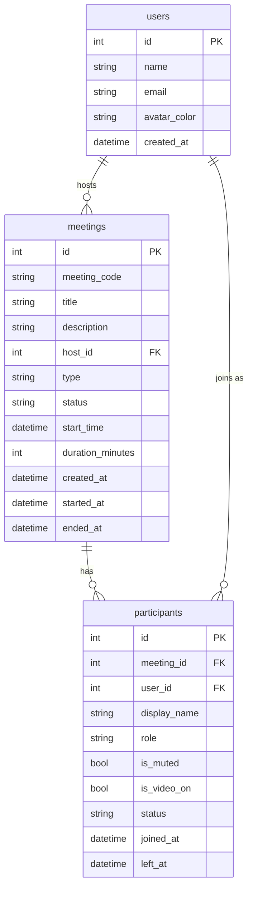

# Zoom Clone

A full-stack Zoom web-app clone built with **Next.js (App Router, TypeScript, Tailwind CSS, shadcn/ui)** on the frontend and **Python FastAPI + SQLite (SQLAlchemy)** on the backend, with native **WebRTC peer-to-peer** audio/video.

🌐 **Live demo:** [https://zoom-clonehv.vercel.app](https://zoom-clonehv.vercel.app)  
🔧 **Backend API:** [https://zoom-clone-dq29.onrender.com](https://zoom-clone-dq29.onrender.com)

---

## Features

- **Authentication** — Sign in / Register flow with session tokens and password hashing; includes a 1-click **"Fill Default"** button that automatically inputs demo credentials (`alex@example.com` / `demo1234`)
- **Direct Guest Join** — Users who don't want to log in can join any meeting directly from the login page or via invite links (`/j/[code]`) by entering their name only
- **Dashboard** — Zoom-style navbar, 2×2 action tiles (New Meeting, Join, Schedule, Share), live clock, Upcoming and Recent meeting lists
- **New Meeting** — instantly creates a unique 10-digit meeting and joins as host; shows a copyable invite link
- **Join** — by Meeting ID (spaces / dashes / full URL accepted), validates existence and ended state
- **Schedule** — title, description, date picker, 15-min time slots, duration selector; appears in Upcoming immediately; auto-replenishes if <2 future meetings exist
- **Pre-join screen** — live camera preview, mic/camera toggles, name input
- **Meeting Room** — dark full-screen layout, adaptive video grid (1–8+ tiles), info popover with meeting ID + invite link
- **WebRTC audio/video** — native mesh `RTCPeerConnection` with FastAPI WebSocket signaling; ICE candidate queuing; graceful audio-only fallback when camera is unavailable
- **Control bar** — always-visible labeled buttons for Mute, Stop Video, Participants count badge, Share (placeholder), Leave / End
- **Participants panel** — mobile bottom-sheet / desktop side-sheet with mic/video status icons; host gets Mute All + per-participant Mute / Remove
- **Host removal** — removed participant is instantly kicked via WebSocket `removed` event and redirected to home
- **Host transfer** — if the host leaves or reloads, a random remaining participant is automatically promoted to host; they receive an instant `host_changed` WebSocket event and a toast notification
- **Meeting ends properly** — when the last participant leaves, the meeting is marked `ended` and appears in Recents
- **Real-time sync** — 2-second polling handles mute state, removal detection, and meeting-ended redirects; WebSocket events deliver instant updates (kicked, host changed)
- **Mobile-first responsive UI** — `100dvh` layout, responsive video grid, circular icon badges, bottom-sheet participants panel
- **Seed data** — 4 upcoming + 5 ended meetings on fresh DB; auto-replenishes upcoming meetings on every request if fewer than 2 remain

---

## Tech Stack

| Layer | Technology |
|---|---|
| Frontend | Next.js 16 (App Router, Turbopack), TypeScript, Tailwind CSS, shadcn/ui, lucide-react, sonner |
| Backend | Python 3.13, FastAPI 0.142, Uvicorn |
| Database | SQLite via SQLAlchemy 2.1 (ORM), no migrations needed |
| Real-time | Native WebRTC mesh + FastAPI WebSocket signaling |
| Hosting | Vercel (frontend) + Render free tier (backend, SQLite) |

---

## Folder Structure

```
zoom-clone/
  backend/
    app/
      main.py            # FastAPI app, CORS, router include, startup (create tables + seed)
      database.py        # engine, SessionLocal, Base, get_db
      models.py          # SQLAlchemy ORM models (User, Meeting, Participant + enums)
      schemas.py         # Pydantic request/response models
      utils.py           # meeting code generator, normalize_code()
      seed.py            # seed_if_empty(db) — seeds upcoming + past meetings
      routers/
        meetings.py      # create, list, upcoming, recent, get, delete, join, end, mute-all
        participants.py  # list, update self, leave (with host transfer), remove
        signal.py        # WebSocket /ws/{code} signaling; broadcast_to_room, close_room
    requirements.txt
  frontend/
    app/
      page.tsx                  # Dashboard (home)
      j/[code]/page.tsx         # Invite link entry → pre-join screen
      meeting/[code]/page.tsx   # Meeting room (WebRTC, polling, controls)
      layout.tsx, globals.css
    components/
      navbar.tsx
      action-tile.tsx           # New / Join / Schedule / Share tiles
      join-dialog.tsx
      schedule-dialog.tsx
      meeting-list.tsx          # Reused for Upcoming + Recent
      clock-card.tsx            # Live time/date card on dashboard
      prejoin.tsx               # Name input + camera preview
      meeting-room/
        video-tile.tsx          # Single participant video/avatar tile
        control-bar.tsx         # Mic / Cam / People / Share / Leave / End
        participants-panel.tsx  # Bottom-sheet (mobile) / side-sheet (desktop)
      ui/                       # shadcn generated components
    lib/
      api.ts                    # Typed fetch wrapper + getApiBase() runtime URL detection
      use-webrtc.ts             # WebRTC mesh hook (offers, answers, ICE, host_changed, removed)
      utils.ts                  # cn, formatMeetingId, inviteLink, etc.
  README.md
```

---

## Database Schema

### Tables

**users**
| Column | Type | Notes |
|---|---|---|
| id | INTEGER PK | |
| name | VARCHAR | |
| email | VARCHAR UNIQUE | |
| avatar_color | VARCHAR | hex color |
| created_at | DATETIME | UTC |

**meetings**
| Column | Type | Notes |
|---|---|---|
| id | INTEGER PK | |
| meeting_code | VARCHAR(10) UNIQUE INDEX | 10-digit numeric |
| title | VARCHAR | |
| description | VARCHAR | nullable |
| host_id | INTEGER FK→users.id | |
| type | ENUM(instant, scheduled) | |
| status | ENUM(scheduled, live, ended) | |
| start_time | DATETIME | nullable, UTC |
| duration_minutes | INTEGER | default 30 |
| created_at | DATETIME | UTC |
| started_at | DATETIME | nullable |
| ended_at | DATETIME | nullable, set when meeting ends |

**participants**
| Column | Type | Notes |
|---|---|---|
| id | INTEGER PK | |
| meeting_id | INTEGER FK→meetings.id CASCADE INDEX | |
| user_id | INTEGER FK→users.id | nullable (guests) |
| display_name | VARCHAR | |
| role | ENUM(host, participant) | dynamically transferred on host leave |
| is_muted | BOOLEAN | |
| is_video_on | BOOLEAN | |
| status | ENUM(joined, left, removed) | |
| joined_at | DATETIME | |
| left_at | DATETIME | nullable |

### ER Diagram



---

## API Endpoints

| Method | Path | Description |
|---|---|---|
| POST | `/api/auth/login` | Login with email & password (default: `alex@example.com` / `demo1234`) |
| POST | `/api/auth/register` | Register a new user account |
| GET | `/api/auth/me` | Validate session token and return user profile |
| GET | `/api/me` | Return default user |
| POST | `/api/meetings` | Create instant or scheduled meeting |
| GET | `/api/meetings/upcoming` | Scheduled meetings in the future (auto-seeds if empty) |
| GET | `/api/meetings/recent` | Ended meetings, newest first |
| GET | `/api/meetings/{code}` | Get meeting by code |
| DELETE | `/api/meetings/{code}` | Delete scheduled meeting (host) |
| POST | `/api/meetings/{code}/join` | Join meeting, create participant row |
| POST | `/api/meetings/{code}/end` | End meeting for all (host only) |
| POST | `/api/meetings/{code}/mute-all` | Mute all non-host participants (host only) |
| GET | `/api/meetings/{code}/participants` | List currently joined participants |
| PATCH | `/api/participants/{id}` | Update own mute/video state |
| POST | `/api/participants/{id}/leave` | Mark self as left; triggers host transfer if needed |
| DELETE | `/api/participants/{id}` | Remove participant from meeting (host only) |
| WS | `/ws/{code}?pid={id}` | WebSocket signaling (SDP offer/answer/ICE + control events) |

Host endpoints require the `X-Participant-Id` header.

### WebSocket Message Types

| Direction | Type | Payload | Description |
|---|---|---|---|
| Server → Client | `peers` | `{ ids: number[] }` | Existing peer IDs on join |
| Client → Server | `offer` / `answer` / `ice` | `{ to, type, data }` | WebRTC signaling |
| Server → Client | `offer` / `answer` / `ice` | `{ from, type, data }` | Forwarded signaling |
| Server → Client | `left` | `{ id }` | Peer disconnected |
| Server → Client | `removed` | — | You were removed by the host |
| Server → Client | `host_changed` | `{ new_host_id }` | Host role transferred |

---

## Local Setup

### Backend

```bash
cd zoom-clone/backend
python -m venv venv
# Windows:
.\venv\Scripts\activate
# macOS/Linux:
source venv/bin/activate

pip install -r requirements.txt
uvicorn app.main:app --reload --port 8000
```

The backend creates `zoom_clone.db` and seeds it on first run. Tables are created automatically — no migration tool needed.

### Frontend

```bash
cd zoom-clone/frontend
npm install
npm run dev
```

Open [http://localhost:3000](http://localhost:3000).

### Environment Variables

**Backend** (optional, defaults shown):
```
FRONTEND_ORIGIN=http://localhost:3000
```

**Frontend** (`.env.local`):
```
# Not needed for local dev — getApiBase() auto-detects localhost vs cloud
API_URL=http://localhost:8000
```

> **Cloud note:** The frontend uses a runtime `getApiBase()` helper that checks `window.location.hostname` to resolve the correct backend URL. This avoids the need for `NEXT_PUBLIC_*` build-time variables on Vercel.

---

## Deployment

### Frontend → Vercel
1. Push repo to GitHub
2. Import in Vercel, set root directory to `frontend`
3. No extra env vars needed (URL detection is runtime)

### Backend → Render
1. New Web Service, root directory `backend`
2. Build command: `pip install -r requirements.txt`
3. Start command: `uvicorn app.main:app --host 0.0.0.0 --port $PORT`
4. Add env var: `FRONTEND_ORIGIN=https://your-app.vercel.app`

> **SQLite on free tier:** The DB file is ephemeral and resets on redeploy/restart. The app re-seeds automatically on every startup so the demo is never empty.

| Service | URL |
|---|---|
| Frontend | https://zoom-clonehv.vercel.app |
| Backend | https://zoom-clone-dq29.onrender.com |

---

## Architecture Notes

### WebRTC Mesh
Each participant forms a direct `RTCPeerConnection` with every other participant (full mesh). The FastAPI WebSocket server only handles signaling (SDP + ICE) — it never touches media. For N participants, there are N×(N−1)/2 peer connections.

### Host Transfer Flow
```
Host closes tab / reloads
        ↓
sendBeacon → POST /api/participants/{id}/leave
        ↓
backend: mark host as "left"
        ↓
Any other joined participants?
   YES → pick random one → set role=host → broadcast host_changed via WS
   NO  → set meeting.status=ended, meeting.ended_at=now()
```

### Polling + WebSocket Events
| Event | Delivery | Latency |
|---|---|---|
| Mute state change | Polling | ≤ 2 s |
| Participant list update | Polling | ≤ 2 s |
| Meeting ended | Polling | ≤ 2 s |
| Host removed you | WebSocket `removed` | instant |
| Host role transferred | WebSocket `host_changed` | instant |

---

## Assumptions

- **No auth system** — a single default user (Alex Johnson, id=1) is always "logged in". All meetings are owned by this user.
- **Host identification** — host actions pass `X-Participant-Id` header; the backend loads that participant row and checks `role=host`. No JWT or session tokens.
- **Guest join** — guests join by entering a name only; their participant row has `user_id=NULL`.
- **Media streaming** — WebRTC mesh with public Google STUN; no TURN server, so media may fail behind strict symmetric NATs.
- **SQLite** — chosen for zero-config local development. File is excluded from git; re-seeded on every startup.

## Known Limitations

- No TURN server (media uses Google public STUN; may fail behind strict symmetric NATs / enterprise firewalls)
- SQLite is not suitable for high concurrent production load
- No authentication — anyone with the meeting ID can join
- Screen sharing is a placeholder (shows a toast notification)
- WebRTC mesh does not scale efficiently beyond ~6–8 participants (use an SFU for larger rooms)
