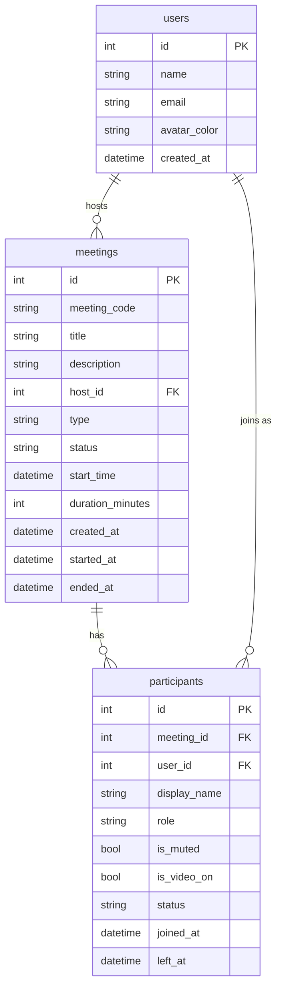

# Zoom Clone

A full-stack Zoom web-app clone built with **Next.js (App Router, TypeScript, Tailwind, shadcn/ui)** on the frontend and **Python FastAPI + SQLite (SQLAlchemy)** on the backend.

---

## Features

- **Dashboard** — Zoom-style navbar, 2×2 action tiles (New Meeting, Join, Schedule, Share), live clock, Upcoming and Recent meeting lists
- **New Meeting** — instantly creates a unique 10-digit meeting and joins as host; shows a copyable invite link
- **Join** — by Meeting ID (spaces/dashes/full URL accepted), validates existence and ended state
- **Schedule** — title, description, date picker, 15-min time slots, duration selector; appears in Upcoming immediately
- **Pre-join screen** — live camera preview, mic/camera toggles, name input
- **Meeting Room** — dark full-screen layout, video grid, elapsed timer, info popover with meeting ID + invite link
- **Control bar** — Mute, Stop Video, Participants panel, Share (placeholder), Leave/End
- **Participants panel** — side sheet with mic/video status; host gets Mute All + per-participant Mute/Remove
- **Real-time sync** — 2-second polling: handles mute-all, removal, and meeting-ended redirects
- **Host controls** — Mute All, Remove participant (status=removed), End meeting for all
- **Responsive** — Tailwind breakpoints for mobile/tablet/desktop
- **Seed data** — 4 upcoming + 5 ended meetings on fresh DB; runs on every startup

---

## Tech Stack

| Layer     | Technology                                  |
|-----------|---------------------------------------------|
| Frontend  | Next.js 16 (App Router), TypeScript, Tailwind CSS, shadcn/ui, lucide-react |
| Backend   | Python 3.13, FastAPI 0.142, Uvicorn         |
| Database  | SQLite via SQLAlchemy 2.1 (ORM), no migrations |
| Hosting   | Vercel (frontend) + Render/Railway (backend) |

---

## Folder Structure

```
zoom-clone/
  backend/
    app/
      main.py          # FastAPI app, CORS, router include, startup (create tables + seed)
      database.py      # engine, SessionLocal, Base, get_db
      models.py        # SQLAlchemy models
      schemas.py       # Pydantic request/response models
      utils.py         # meeting code generator, code normalizer
      seed.py          # seed_if_empty(db)
      routers/
        meetings.py    # create, list, get, delete, join, end, mute-all
        participants.py# list, update self, leave, remove
    requirements.txt
  frontend/
    app/
      page.tsx                 # Dashboard (home)
      j/[code]/page.tsx        # Invite link entry -> pre-join screen
      meeting/[code]/page.tsx  # Meeting room
      layout.tsx, globals.css
    components/
      navbar.tsx
      action-tile.tsx          # the big New/Join/Schedule/Share tiles
      join-dialog.tsx
      schedule-dialog.tsx
      meeting-list.tsx         # reused for Upcoming + Recent
      clock-card.tsx           # big time/date card on dashboard
      prejoin.tsx              # name input + camera preview
      meeting-room/
        video-tile.tsx
        control-bar.tsx
        participants-panel.tsx
      ui/                      # shadcn generated
    lib/api.ts                 # tiny typed fetch wrapper
    lib/utils.ts               # cn, formatMeetingId, etc.
  README.md
```

---

## Database Schema

### Tables

**users**
| Column | Type | Notes |
|---|---|---|
| id | INTEGER PK | |
| name | VARCHAR | |
| email | VARCHAR UNIQUE | |
| avatar_color | VARCHAR | hex color |
| created_at | DATETIME | UTC |

**meetings**
| Column | Type | Notes |
|---|---|---|
| id | INTEGER PK | |
| meeting_code | VARCHAR(10) UNIQUE INDEX | 10-digit numeric |
| title | VARCHAR | |
| description | VARCHAR | nullable |
| host_id | INTEGER FK→users.id | |
| type | ENUM(instant,scheduled) | |
| status | ENUM(scheduled,live,ended) | |
| start_time | DATETIME | nullable, UTC |
| duration_minutes | INTEGER | default 30 |
| created_at | DATETIME | UTC |
| started_at | DATETIME | nullable |
| ended_at | DATETIME | nullable |

**participants**
| Column | Type | Notes |
|---|---|---|
| id | INTEGER PK | |
| meeting_id | INTEGER FK→meetings.id CASCADE INDEX | |
| user_id | INTEGER FK→users.id | nullable (guests) |
| display_name | VARCHAR | |
| role | ENUM(host,participant) | |
| is_muted | BOOLEAN | |
| is_video_on | BOOLEAN | |
| status | ENUM(joined,left,removed) | |
| joined_at | DATETIME | |
| left_at | DATETIME | nullable |

### ER Diagram



---

## API Endpoints

| Method | Path | Description |
|---|---|---|
| GET | `/api/me` | Return default user |
| POST | `/api/meetings` | Create instant or scheduled meeting |
| GET | `/api/meetings/upcoming` | Scheduled meetings in the future |
| GET | `/api/meetings/recent` | Ended meetings, newest first |
| GET | `/api/meetings/{code}` | Get meeting by code |
| DELETE | `/api/meetings/{code}` | Delete scheduled meeting (host) |
| POST | `/api/meetings/{code}/join` | Join meeting, create participant row |
| POST | `/api/meetings/{code}/end` | End meeting for all (host) |
| POST | `/api/meetings/{code}/mute-all` | Mute all non-host participants (host) |
| GET | `/api/meetings/{code}/participants` | List joined participants |
| PATCH | `/api/participants/{id}` | Update own mute/video state |
| POST | `/api/participants/{id}/leave` | Mark self as left |
| DELETE | `/api/participants/{id}` | Remove participant (host) |

Host endpoints require the `X-Participant-Id` header (the participant's own id).

---

## Local Setup

### Backend

```bash
cd zoom-clone/backend
python -m venv venv
# Windows:
.\venv\Scripts\activate
# macOS/Linux:
source venv/bin/activate

pip install -r requirements.txt
uvicorn app.main:app --reload --port 8000
```

The backend creates `zoom_clone.db` and seeds it on first run.

### Frontend

```bash
cd zoom-clone/frontend
npm install
npm run dev
```

Open [http://localhost:3000](http://localhost:3000).

### Environment Variables

**Backend** (optional, defaults shown):
```
FRONTEND_ORIGIN=http://localhost:3000
```

**Frontend** (`.env.local`):
```
NEXT_PUBLIC_API_URL=http://localhost:8000
```

---

## Deployment

### Frontend → Vercel
1. Push repo to GitHub
2. Import in Vercel, set root dir to `frontend`
3. Add env var: `NEXT_PUBLIC_API_URL=https://your-backend.onrender.com`

### Backend → Render
1. New Web Service, root dir `backend`
2. Start command: `uvicorn app.main:app --host 0.0.0.0 --port $PORT`
3. Add env var: `FRONTEND_ORIGIN=https://your-app.vercel.app`

> **Note:** SQLite on free hosting tiers is ephemeral (resets on redeploy). The app re-seeds automatically on every startup so the demo is never empty.

| Service | URL |
|---|---|
| Frontend | _deploy to Vercel and paste here_ |
| Backend | _deploy to Render and paste here_ |

---

## Assumptions

- **No auth system** — a single default user (Alex Johnson, id=1) is always "logged in". The `DEFAULT_USER_ID=1` constant appears in one place (`seed.py`) and is imported where needed.
- **Host identification** — host actions pass `X-Participant-Id` header; the backend loads that participant row and checks `role=host`. No JWT or session.
- **Guest join** — guests join by entering a name only; their participant row has `user_id=NULL`.
- **Media streaming** — Media uses a WebRTC mesh with a FastAPI WebSocket signalling server and public STUN; no TURN, so it may fail behind strict NATs.
- **Polling for state** — participant list, mute state, and meeting status are polled every 2 seconds. WebRTC carries audio and video media.
- **SQLite** — chosen for zero-config local development. File is excluded from git; re-seeded on every startup.
- **Delete from dashboard** — requires the user to have previously started the meeting (participant id stored in sessionStorage). This is a deliberate simplification noted here.

## Known Limitations

- No TURN server included (media uses Google public STUN; may fail behind strict symmetric NATs / enterprise firewalls)
- SQLite is not suitable for concurrent production load
- No authentication — any person can join any meeting by ID
- Screen sharing is a placeholder (toast notification)
